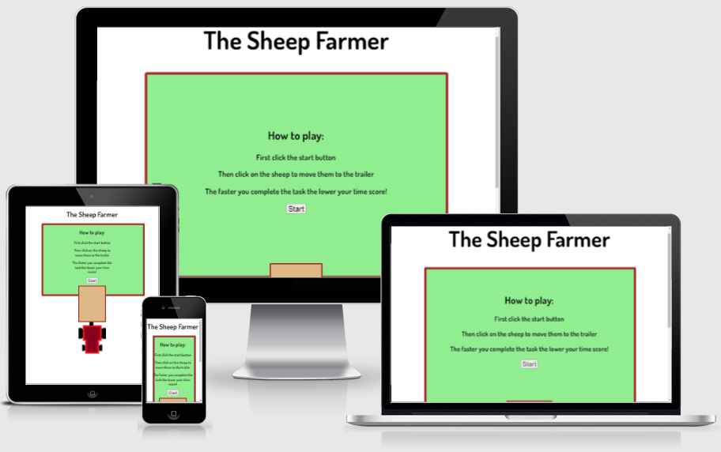
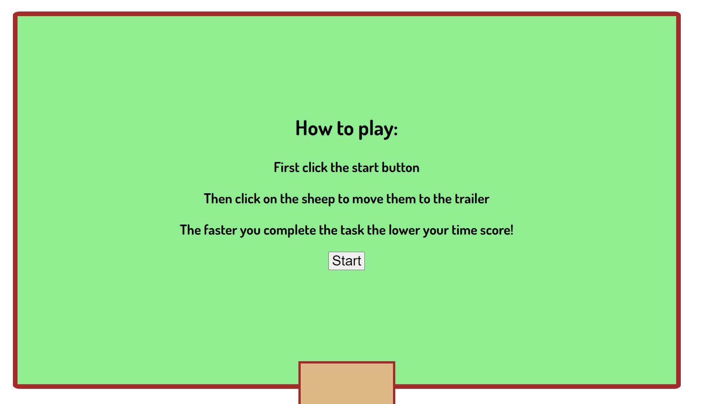
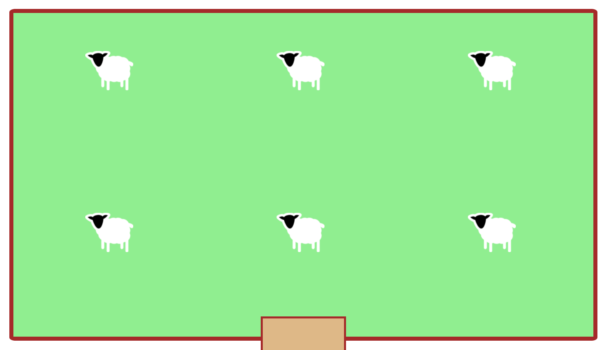
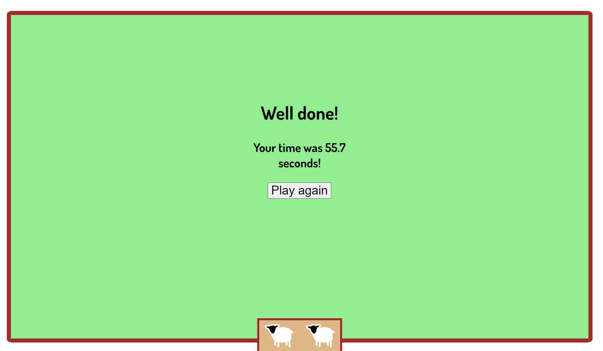
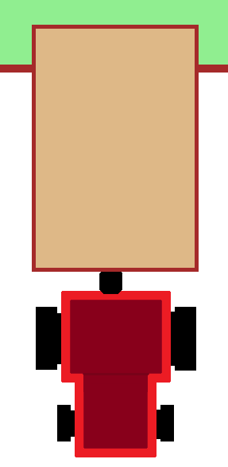

# The Sheep Farmer

The Sheep Farmer is a simple yet competitive game. 
It was created using HTML, CSS and Javascript. 
By clicking each sheep image the user will then be able to deposit the sheep to the trailer. There is a built in timer calculating the duration it took for the user to complete the task, therefore giving the opportunity to beat you and your friend’s time with each round that you play. 

## Features 

### Existing Features
 
- The Sheep Farmer Page Heading
 
  - Featured at the top of the page, The Title Header is immediately visible to the user upon loading the page, the user will be able to see the name of the game.
 

 
- The Start Menu
 
  - This is the menu that appears on load of the webpage, from here the user will be able to click the start button to start the game.
 

 
- The Game Area
 
  - This is the area where the sheep will be displayed. The user can then click the sheep to move them to the trailer, when the user has clicked on all of the sheep the game will terminate.
 

 
- The End Menu
 
  -This menu will be displayed when the game terminates, it will also display to a decimal point how many seconds it took for the user to complete this task.
 

 
- The Tractor
 
  - This part of the page appears below the field, when the user starts the game and clicks on a sheep it will appear in the trailer as a user response.

## Testing 

I firstly tested the buttons to make sure they all showed and concealed the correct elements, this all worked accordingly.
 
Then I tested the sheep, Making sure they were all visible and correctly positioned at the right time in both the field and in the trailer.
 
I then finished by testing the timer by publicly releasing the website to my family and friends, all of which returned to me with positive feedback, satisfactory results and scores as low as 1 second.

### Validator Testing 

- HTML
    - No errors were returned when passing through the official [W3C validator](https://validator.w3.org/nu/?doc=https%3A%2F%2Fcode-institute-org.github.io%2Flove-maths%2F)
- CSS
    - No errors were found when passing through the official [(Jigsaw) validator](https://jigsaw.w3.org/css-validator/validator?uri=https%3A%2F%2Fvalidator.w3.org%2Fnu%2F%3Fdoc%3Dhttps%253A%252F%252Fcode-institute-org.github.io%252Flove-maths%252F&profile=css3svg&usermedium=all&warning=1&vextwarning=&lang=en)
- JavaScript
    - No errors were found when passing through the official [Jshint validator](https://jshint.com/)
      - The following metrics were returned: 
      - There are 10 functions in this file.
      - Function with the largest signature takes 0 arguments, while the median is 0.
      - Largest function has 5 statements in it, while the median is 5.
      - The most complex function has a cyclomatic complexity value of 2 while the median is 2.

### Unfixed Bugs

There are no detected unfixed bugs

## Deployment

- This site was deployed to GitHub pages. 
- This is the dploymnt porcedure: 
  - In the GitHub repository, navigate to the Settings tab and then to the pages tab along the left
  - From the source section drop-down menu, select the main branch
  - Once the main branch has been selected click save and after a short amount of time refresh the page untill the link appears green and says 'Your site is published at https://titanjoe.github.io/project-two-the-sheep-farmer/'

## Credits
### Content 

- The page font was taken from Google Fonts
- see https://fonts.google.com/specimen/Dosis?preview.text=The%20Sheep%20Farmer&preview.text_type=custom

### Media

- The images for the sheep were taken and edited from PNGTAB 
- See https://pngtab.com/png/mbrX2L40n1/sheep-farming-suzy-livestock-wool-visit-vector-free-png
- The format of the readme was taken from Code Institute Solutions on Github
- see https://github.com/Code-Institute-Solutions/readme-love-maths/blob/master/README.md